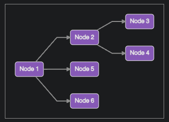
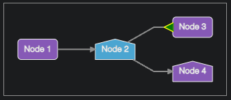

!!! Work In Progress !!!

# solidjs-dep-graph

SolidJS component for rendering a dependency graph layout using Dagre layout

[Examples Demo](https://alitajeldin.github.io/solidjs-dep-graph/)

# Getting started

Install solidjs-dep-graph using npm, pnpm, or yarn.

```
# npm
npm install solidjs-dep-graph --save
# pnpm
pnpm add solidjs-dep-graph
# yarn
yarn add solidjs-dep-graph
```

# Basic usage

Graph component needs to be provided a set of Nodes and Edges at a minimum.

```typescript
import { Node, Edge, Graph } from "solidjs-dep-graph";
function App() {
  const nodes: Node[] = [
    Node("1", "Node 1"),
    Node("2", "Node 2"),
    Node("3", "Node 3"),
    Node("4", "Node 4"),
    Node("5", "Node 5"),
    Node("6", "Node 6"),
  ];
  const edges: Edge[] = [
    Edge("1", "2",),
    Edge("2", "3",),
    Edge("2", "4"),
    Edge("1", "5"),
    Edge("1", "6",),
  ];

  return <Graph nodes={nodes} edges={edges}/>
}
```
The above would produce the following graph.



# Styling Override
TBD

# Custom Shapes / Markers
solidjs-dep-graph allows user to provide custom shapes and markers.



See [Customization](./docs/custom.md) documentation for details.

# Documentation
* [API Documentation](./docs/api.md)

# TBD
* Where and How to run the example code

# CREDIT
Many of the ideas here (especially the intersect code) came from [dagre-reactjs](https://github.com/bobthekingofegypt/dagre-reactjs).
